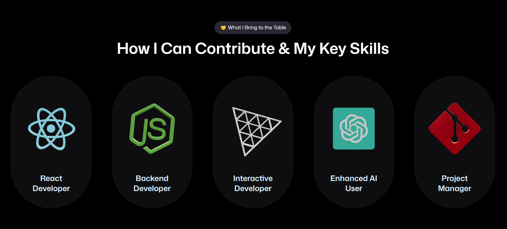
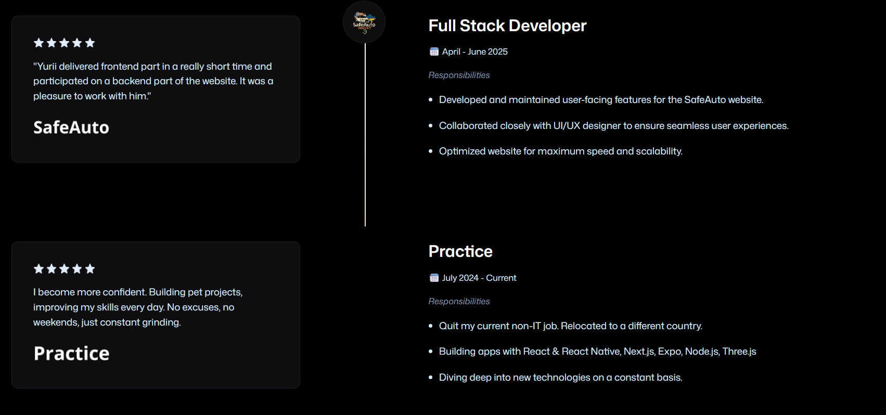

# 🚀 whoisyurii's 3D Portfolio

A modern, interactive portfolio built with **React**, **Three.js**, **GSAP**, **Tailwind** and **Vite**. Showcasing my skills, projects, and journey as a junior developer looking for real-world opportunities!

---

## 👨‍💻 About Me

Hi! I'm **Yurii Mashchuk**, a passionate junior developer from Ukraine. I love building beautiful, interactive web experiences and am always eager to learn and grow. Looking for an Internship or Junior position — let's connect!

- [LinkedIn](https://www.linkedin.com/in/yurii-mashchuk/)
- [GitHub](https://github.com/whoisyurii)
- [Email](mailto:yuriimashchuk@gmail.com)

---

## ✨ Features

- **Responsive Design** — Looks great on desktop, tablet, and mobile
- **Animated Hero Section** — Awesome 3D model of my room and smooth transitions
- **3D Tech Stack Icons** — Interactive, performant, and lazy-loaded Three.js models
- **Testimonials & Timeline** — Realistic, friendly, and humanized content
- **Contact Form** — Fun placeholders and easy to reach out

---

## 🛠️ Tech Stack

- [React](https://react.dev/)
- [Three.js](https://threejs.org/)
- [@react-three/fiber](https://docs.pmnd.rs/react-three-fiber/getting-started/introduction)
- [GSAP](https://gsap.com/)
- [Vite](https://vitejs.dev/)
- [Tailwind CSS](https://tailwindcss.com/) (v4 utility classes)

---

## 📸 Screenshots

|           Hero Section            |                Tech Stack                 |              Timeline               |
| :-------------------------------: | :---------------------------------------: | :---------------------------------: |
|  |  |  |

---

> _"Thanks for checking out my portfolio! If you like what you see, let’s build something awesome together!"_
